# 👤 Profile

My name is Xavier William, I am an Indonesian undergraduate student at the University of Toulouse Jean-Jaurès, where I study Geography, Spatial Planning, and Environmental Studies. My interests include geomatics, GIS, and geospatial data analysis.

## 💻 Specialties 

## 🗣️ Languages

# 🗂️ Portfolio
A personal collection of geospatial projects analyzing environmental and socio-economic disparities across territories, using maps and analytical diagrams to explore spatial patterns, global issues, and GIS methodologies.
## Overview
- [Lyon Healthcare Accessibility](#lyon-healthcare-accessibility)
- [Warsaw Public Transport](#warsaw-public-transport)
- [North American Biomes](#north-american-biomes)
- [U.S. Wildfires](#us-wildfires) 
- [Continental U.S. Tornadoes](#continental-us-tornadoes)

## Lyon Healthcare Accessibility

    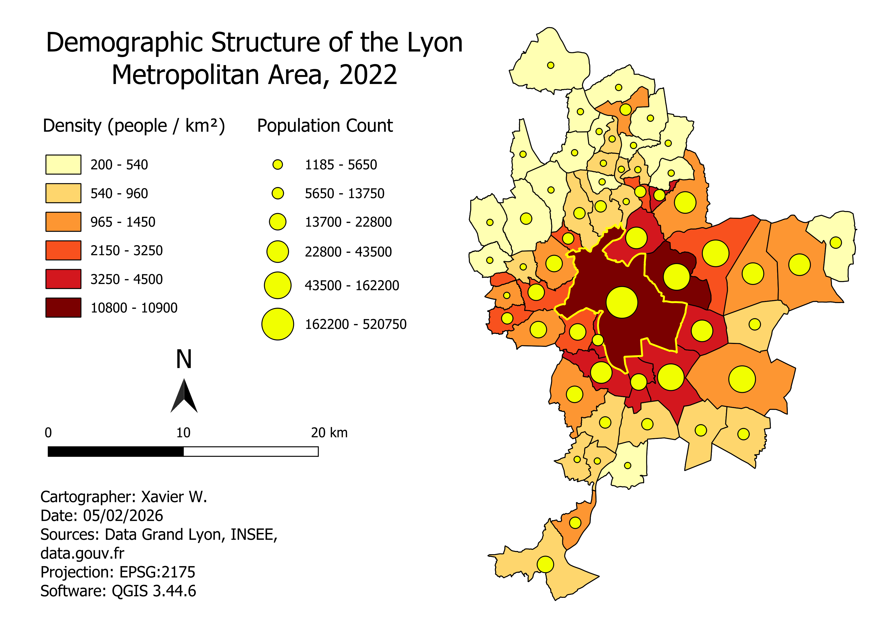
   
    <em>Figure 1.a</em>

I developed this map to visualize the healthcare demand index. Population density is calculated by dividing the total population count of each municipality by its surface area in km² in order to create the color-coded density classes. Population circles are then scaled proportionally to represent the absolute population count of each commune, providing both intensive (density) and extensive (absolute numbers) perspectives.

* Very high population density in central Lyon and multiple eastern communes
* Large population circles concentrated in central zones
* Sharp density and population drop from dark red core to northern and southern peripheries

 

    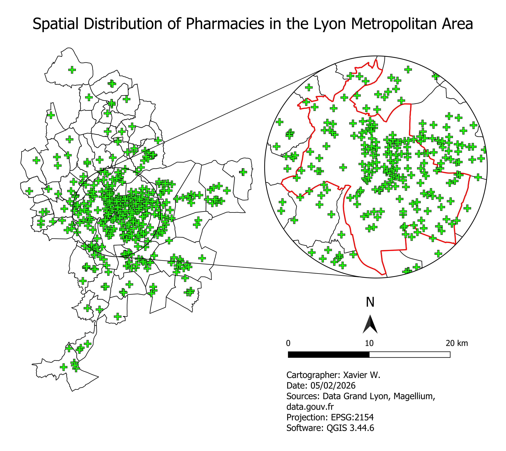
     
    <em>Figure 1.b</em>

Each pharmacy location is plotted as a point on the map using geocoded coordinates from the data sources. Pharmacies exhibit a dense and widespread distribution throughout the Lyon metropolitan area, with particularly high concentrations in the central urban zones as evidenced by the detailed inset. The network shows strong coverage in developed urban and suburban areas, while gradually thinning toward the periphery.

* Primary dense cluster in central Lyon with high coverage across urban and suburban areas
* Gradual decrease in density moving outward
* Sparse but present distribution in peripheral municipalities

 

    
     
    <em>Figure 1.c</em>

General hospital locations are also mapped as point features using geocoded coordinates from the same official data sources. They display a considerably sparser distribution compared to pharmacies, with the majority concentrated within the metropolitan boundary. This limited geographic spread indicates that hospital accessibility is significantly more restricted than pharmacy access, requiring longer travel distances for residents in outlying areas.

* Extreme concentration in central urban core
* Clustered distribution within the red metropolitan boundary
* Limited facilities in peripheral zones
* Multiple communes with complete absence of general hospitals

 

    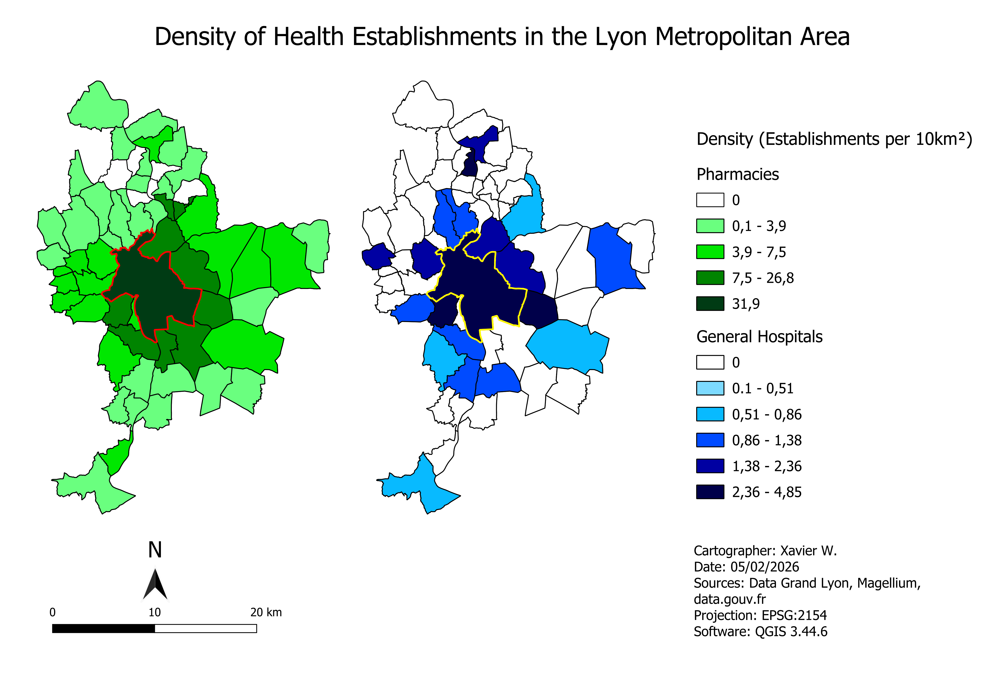
     
    <em>Figure 1.d</em>

Pharmacy and hospital density layers are both calculated by dividing the number of respective establishments in each commune by its surface area to obtain establishments per 10 km². This dual-layer choropleth reveals distinct density patterns for pharmacies and hospitals. Pharmacies show a clear radial gradient with the darkest shading (31.9 per 10km²) in the center, gradually decreasing toward lighter green in peripheral zones. Hospitals display a steeper concentration gradient with the highest density (2.36-4.85 per 10km²) concentrated in the central core, while extensive white zones indicate zero hospital density or presence in outer communes.

* Pharmacy density ranges from 0 to 31.9 per 10km² with clear central concentration
* Hospital density reaches maximum (2.36 - 4.85 per 10km²) with sharper concentration
* Concentric gradient pattern centered on Lyon's core
* Six communes in total with absolute absence of pharmacies in the mid-northern region of the metropolitan area

 

    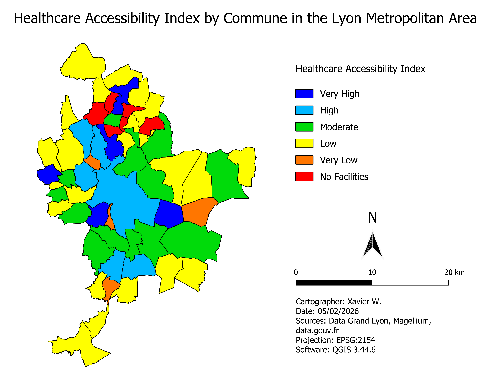
     
    <em>Figure 1.e</em>

This map illustrates healthcare accessibility across the Lyon Metropolitan Area by combining all the previously gathered necessary variables through a composite index. There are huge imbalances between the metropolitan center and its outer peripheries, with Lyon's urban core benefiting from very high to high accessibility while peripheral communes face low accessibility or complete absence of facilities. Scores appear as a fragmented patchwork, though the southern part of the metropolitan area displays more consistent moderate access, deviating from a simple concentric decline. Communes with no facilities (shown in red) are predominantly concentrated in the north, reflecting lower population densities and limited healthcare infrastructure.

* Strong urban core concentration (dark and light blue zones)
* Several peripheric communes with relatively decent level of accessibility
* Multiple disparities between adjacent communes
* Healthcare deserts exclusively in northern periphery (red zones with no facilities)

 

  <i>The formulas used to calculate the required indices, using both <b>standard mathematical equations</b> and <b>code</b>, are provided below:</i>

 

**1. Pharmacy Index**: Measurement of relative availability of pharmacies by calculating the number of pharmacies per 1,000 residents in each commune. The 1,000 multiplier is chosen because pharmacies are relatively abundant, producing interpretable whole numbers that reflect typical accessibility.

$$\text{Pharmacy Index} = \begin{cases} 0 & \text{if pharmacy count} = 0 \\ \frac{\text{pharmacy count}}{\text{population}} \times 1000 & \text{otherwise} \end{cases}$$

    <code>CASE WHEN "pharm_count" = 0 THEN 0 ELSE ("pharm_count" / "population") * 1000 END</code>
    

 

**2. Hospital Index**: Measurement of relative availability of hospitals by calculating the number of hospitals per 10,000 residents in each commune. The 10,000 multiplier is chosen because hospitals are much scarcer than pharmacies. Scaling up the denominator are to avoid producing signicantly small decimal values that would be difficult to interpret and compare.

$$\text{Hospital Index} = \begin{cases} 0 & \text{if hospital count} = 0 \\ \frac{\text{hospital count}}{\text{population}} \times 10000 & \text{otherwise} \end{cases}$$

  <code>CASE WHEN "hosp_count" = 0 THEN 0 ELSE ("hosp_count" / "population") * 10000 END</code>

 

**3. Spatial Coverage Index**: Measurement of the geographic density of all healthcare establishments, both pharmacies and hospitals,  per km² in each municipality, independent of population.

$$\text{Spatial Coverage} = \begin{cases} 0 & \text{if (pharmacy count + hospital count)} = 0 \\ \frac{\text{pharmacy count} + \text{hospital count}}{\text{area km}^2} & \text{otherwise} \end{cases}$$

    <code>CASE WHEN ("pharm_count" + "hosp_count") = 0 THEN 0 ELSE ("pharm_count" + "hosp_count") / "area_km2" END</code>

 

**4. Healthcare Accessibiity Index**: Weighted composite score combining the three indices using coefficients (50% for hospitals, 35% for pharmacies, 15% for spatial coverage), normalized to a 0–100 scale todirectly compare the continuous quantitative variables for each commune.

$$\begin{aligned}
\text{Healthcare Accessibility Index} \ &= 0.50 \times \left( \frac{\text{hospital index} - \min(\text{hospital index})}{\max(\text{hospital index}) - \min(\text{hospital index})} \times 100 \right) \\
& + 0.35 \times \left( \frac{\text{pharmacy index} - \min(\text{pharmacy index})}{\max(\text{pharmacy index}) - \min(\text{pharmacy index})} \times 100 \right) \\
& + 0.15 \times \left( \frac{\text{spatial coverage} - \min(\text{spatial coverage})}{\max(\text{spatial coverage}) - \min(\text{spatial coverage})} \times 100 \right)
\end{aligned}$$

    <code>(0.50 * (("hosp_index" - minimum("hosp_index")) / (maximum("hosp_index") - minimum("hosp_index")) * 100) + 0.35 * (("pharm_index" - minimum("pharm_index")) / (maximum("pharm_index") - minimum("pharm_index")) * 100) + 0.15 * (("spatial_cov_index" - minimum("spatial_cov_index")) / (maximum("spatial_cov_index") - minimum("spatial_cov_index")) * 100))</code>

 

**5. Healthcare Accessibility Score**: Categorical classification system that converts the numeric Healthcare Access Index into five interpretable accessibility categories (No Facilities, Very Low, Low, Moderate, High, Very High) for easier visualization and understanding.

$$\text{Healthcare Accessibility Score} = \begin{cases} 
   \text{No Facilities} & \text{if pharmacy count} = 0 \land \text{hospital count} = 0 \\
   \text{Very Low} & \text{if } 0 < \text{healthcare accessibility index} \leq 15 \\
   \text{Low} & \text{if } 15 < \text{healthcare accessibility index} \leq 25 \\
   \text{Moderate} & \text{if } 25 < \text{healthcare accessibility index} \leq 35 \\
   \text{High} & \text{if } 35 < \text{healthcare accessibility index} \leq 45 \\
   \text{Very High} & \text{healthcare accessibility index} > 45
   \end{cases}$$

<code>CASE WHEN "pharm_count" = 0 AND "hosp_count" = 0 THEN 'No Facilities' WHEN "access_index" <= 15 THEN 'Very Low' WHEN "access_index" <= 25 THEN 'Low' WHEN "access_index" <= 35 THEN 'Moderate' WHEN "access_index" <= 45 THEN 'High' ELSE 'Very High' END</code>

 

## Warsaw Public Transport

    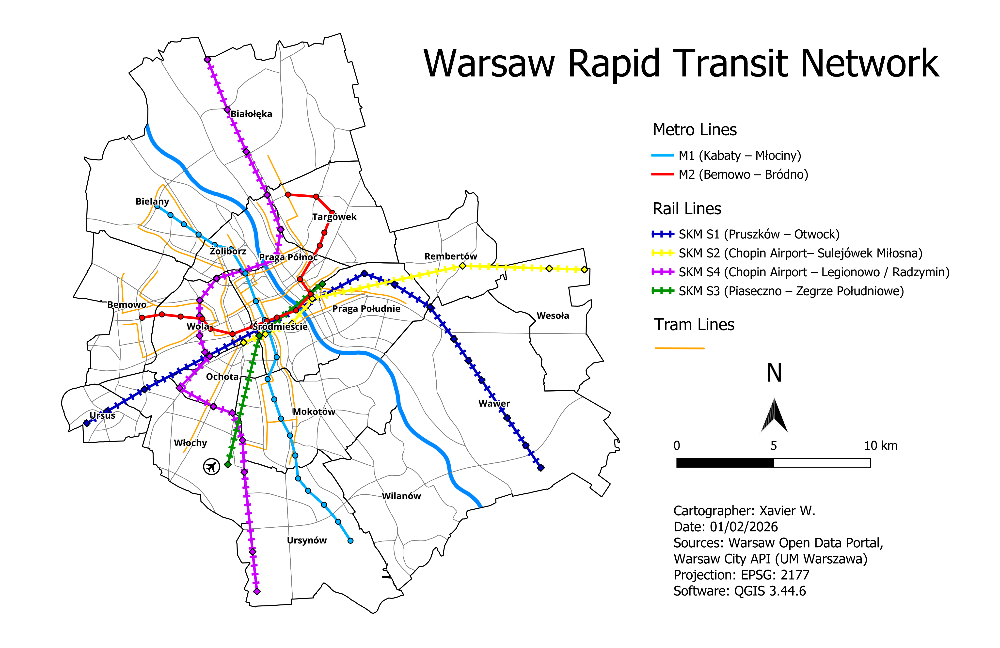
   
    <em>Figure 2.a</em>

This map displays Warsaw's rapid transit infrastructure, including two metro lines (M1 and M2), four rail lines (SKM), and tram networks. The network layout is crucial for understanding the backbone of Warsaw's public transport system, as rapid transit provides higher capacity and faster connections than buses. The map shows the geographic distribution and connectivity of these rail-based systems across Warsaw's districts.

* Central convergence of all rapid transit modes at Śródmieście (city center)
* Metro lines form a perpendicular cross pattern (north-south with M1, east-west with M2)
* Rail lines extend to the furthest ends of peripheral districts, providing most coverage across the city

 

    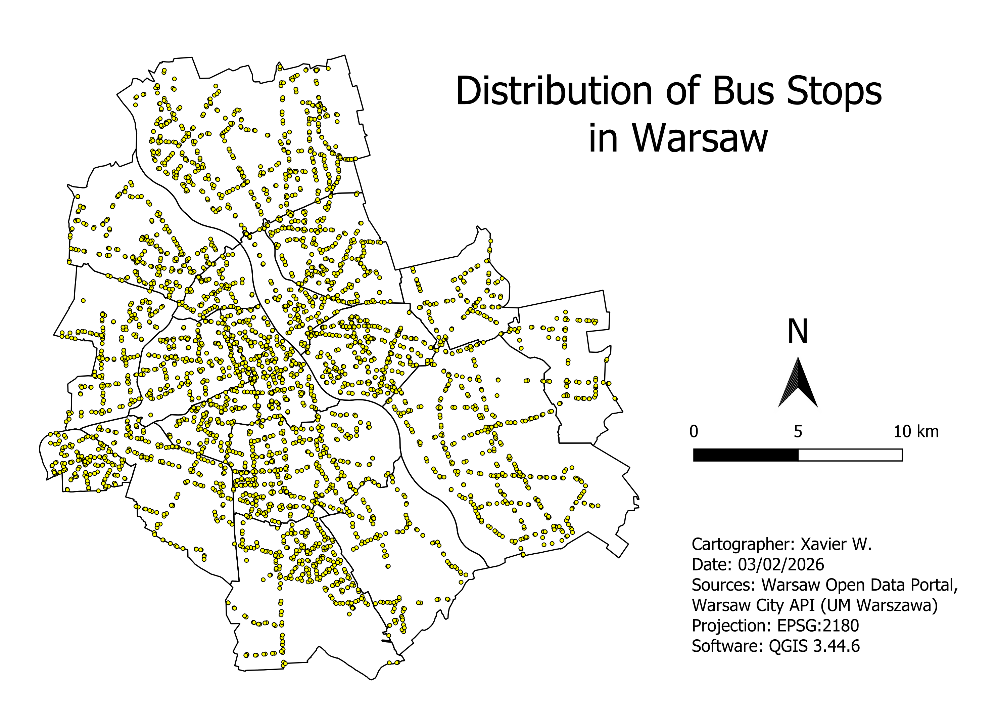
   
     <em>Figure 2.b</em>

This map illustrates the spatial distribution of all bus stops across Warsaw, revealing the fine-grained coverage of the city's most flexible transit mode. Bus networks typically fill gaps left by rail-based transit and provide last-mile connectivity. Each point represents an individual bus stop location based on Warsaw Open Data Portal records.

    
* Dense, web-like coverage across most of the city
* Also highest concentration in central and southern districts
* More dispersed coverage in peripheral eastern districts

 

     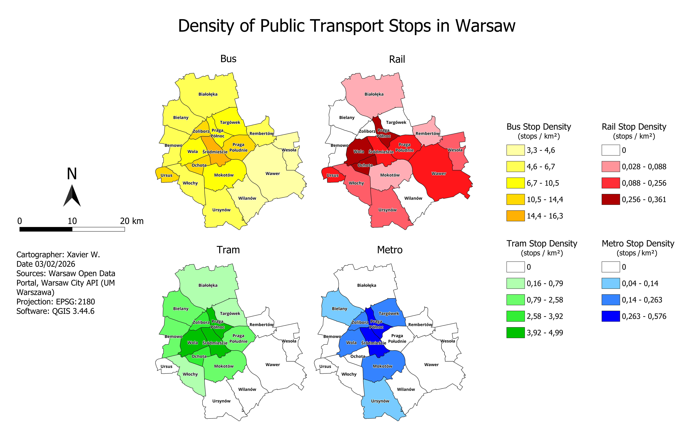
     
     <em>Figure 2.c</em>
  

  This map quantifies public transport accessibility by calculating stop density per square kilometer for each district across all four transit modes. Density was computed by dividing the number of stops by the district's surface area, allowing direct comparison between districts of varying sizes in surface area. This metric reveals which areas have the most intensive transport coverage.
  

* Bus density relatively uniform (most districts have around 4.6 to 10.5 stops per km²), with highest rate in Śródmieście
* Moderate rail density disparitiees between central districts, first-ring and peripheral districts
* Highly unequal tram coverage, concentrated in central-western districts, yet completely absent elsewhere
* South-eastern districts (Wilanów and Wawer) systematically underserved by rail-based transit modes

 

    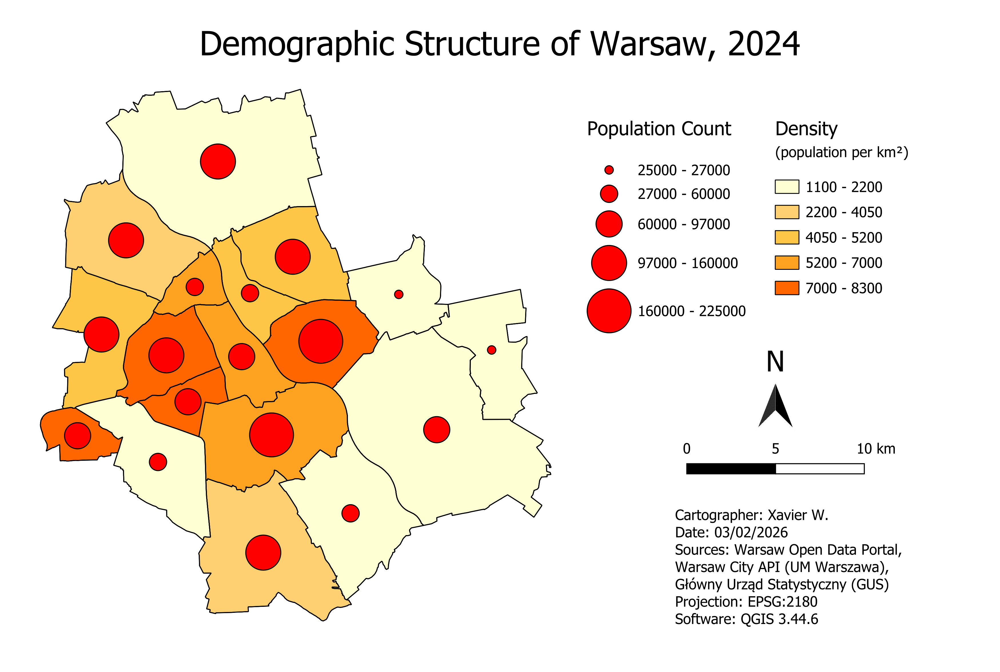
 
    <em>Figure 2.d</em>

This map presents Warsaw's demographic landscape by combining population count (proportional circles) and population density (choropleth shading). Density was calculated by dividing each district's total population by its surface area in square kilometers. Understanding demographic distribution is essential for assessing whether transport infrastructure aligns with where people actually live.

* Highest population densities in central districts (5200-8300 pop/km² in Śródmieście, Wola, Mokotów)
* Large absolute populations in both central and north-western peripheral districts
* Some peripheral districts have large populations but low density due to geographic size
* Białołęka district show low density despite moderate population counts

 
  

    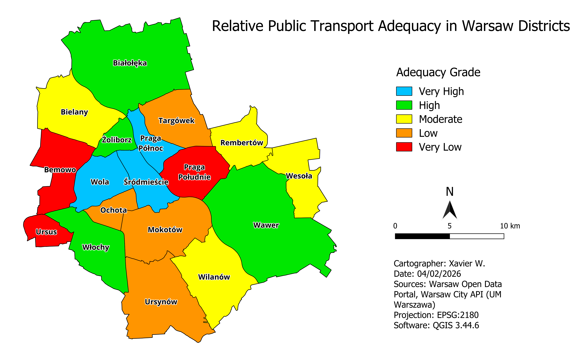
     
    <em>Figure 2.e</em>
   

This map synthesizes transport infrastructure and demographic data into a comprehensive adequacy index, measuring how well public transport provision matches population demand in each district. The index was calculated by combining total stop counts (across all transit modes) and population data into a normalized score. Unlike simple density measures, adequacy accounts for whether infrastructure is proportionate to the number of residents requiring service.

* Very high adequacy in the center (Śródmieście/Wola/Praga Północ)
* Higher adequacy in peripheral districts (Białołęka, Wawer, Włochy) due to lower population pressure
* Systematic western undersupply in Bemowo and Ursus with very low adequacy
* Demand exceeding supply in high-density districts (Mokotów, Praga Południe, Targówek)

 

  <i>The formulas used to calculate the required indices, using both <b>standard mathematical equations</b> and <b>code</b>, are provided below:</i>

 

#### 1. Bus Index

$$\text{Bus Index} = \begin{cases} 0 & \text{if bus count} = 0 \\ \frac{\text{bus count}}{\text{population}} \times 10000 & \text{otherwise} \end{cases}$$

`CASE WHEN "bus_count" = 0 THEN 0 ELSE ("bus_count" / "population") * 10000 END`

#### 2. Tram Index

$$\text{Tram Index} = \begin{cases} 0 & \text{if tram count} = 0 \\ \frac{\text{tram count}}{\text{population}} \times 10000 & \text{otherwise} \end{cases}$$

`CASE WHEN "tram_count" = 0 THEN 0 ELSE ("tram_count" / "population") * 10000 END`

#### 3. Metro Index

$$\text{Metro Index} = \begin{cases} 0 & \text{if metro count} = 0 \\ \frac{\text{metro count}}{\text{population}} \times 10000 & \text{otherwise} \end{cases}$$

`CASE WHEN "metro_count" = 0 THEN 0 ELSE ("metro_count" / "population") * 10000 END`

#### 4. Rail Index 

$$\text{Rail Index} = \begin{cases} 0 & \text{if rail count} = 0 \\ \frac{\text{rail count}}{\text{population}} \times 10000 & \text{otherwise} \end{cases}$$

`CASE WHEN "rail_count" = 0 THEN 0 ELSE ("rail_count" / "population") * 10000 END`

#### 5. Public Transport Index 

$$
\begin{aligned}
\text{Public Transport Index} \ &= 0.30 \times \left( \frac{\text{metro index} - \min(\text{metro index})}{\max(\text{metro index}) - \min(\text{metro index})} \times 100 \right) \\
& + 0.25 \times \left( \frac{\text{rail index} - \min(\text{rail index})}{\max(\text{rail index}) - \min(\text{rail index})} \times 100 \right) \\
& + 0.25 \times \left( \frac{\text{tram index} - \min(\text{tram index})}{\max(\text{tram index}) - \min(\text{tram index})} \times 100 \right) \\
& + 0.20 \times \left( \frac{\text{bus index} - \min(\text{bus index})}{\max(\text{bus index}) - \min(\text{bus index})} \times 100 \right)
\end{aligned}
$$

`(
  0.30 * (("metro_index" - minimum("metro_index")) / (maximum("metro_index") - minimum("metro_index")) * 100) +
  0.25 * (("rail_index" - minimum("rail_index")) / (maximum("rail_index") - minimum("rail_index")) * 100) +
  0.25 * (("tram_index" - minimum("tram_index")) / (maximum("tram_index") - minimum("tram_index")) * 100) +
  0.20 * (("bus_index" - minimum("bus_index")) / (maximum("bus_index") - minimum("bus_index")) * 100)
)`

#### 6. Public Transport Adequacy Grade

$$\text{Transport Score} = \begin{cases} 
   \text{Very Low} & \text{if access index} \leq 20 \\
   \text{Low} & \text{if } 20 < \text{access index} \leq 35 \\
   \text{Moderate} & \text{if } 35 < \text{access index} \leq 50 \\
   \text{High} & \text{if } 50 < \text{access index} \leq 65 \\
   \text{Very High} & \text{if access index} > 65
   \end{cases}$$

`CASE WHEN "access_index" <= 20 THEN 'Very Low' WHEN "access_index" <= 35 THEN 'Low' WHEN "access_index" <= 50 THEN 'Moderate' WHEN "access_index" <= 65 THEN 'High' ELSE 'Very High' END`

 

## North American Biomes

    
   

I developed this map first to illustrate North America’s principal biomes using Level I Ecoregion data, providing environmental context for the continent’s natural phenomena and demographic patterns. Biome boundaries are displayed alongside national administrative divisions, including Canadian provinces, U.S. states, and Mexican *estados.* The continent encompasses a wide range of biomes. Firstly, the Arctic Cordillera and tundra dominate the far north, with cold, arid polar conditions, while Canada’s expansive boreal forests exist under subarctic climates. Secondly, the northeastern United States is characterized by eastern temperate forests, and the central Great Plains feature grasslands across semi-arid to temperate climatic zones. Thirdly, western regions include Pacific coastal forests with marine climates, mountainous northwestern forests spanning multiple elevations, and California’s Mediterranean zone. Lastly, the Southwest features hot, dry deserts, while southern Mexico hosts tropical wet-dry forests, temperate mountain ranges, and semi-arid plateau regions.

## U.S. Wildfires

    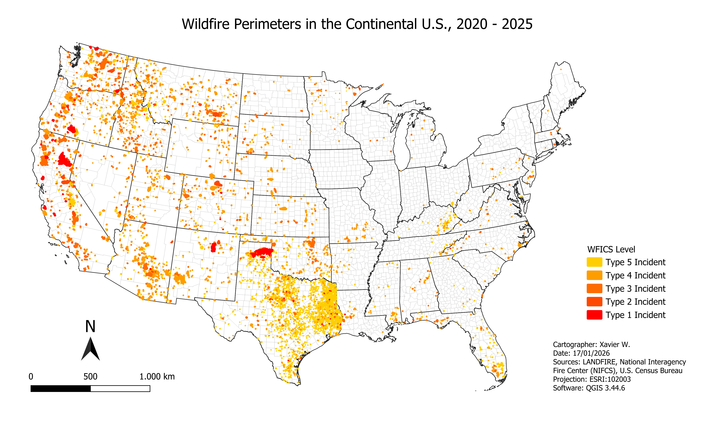
   

    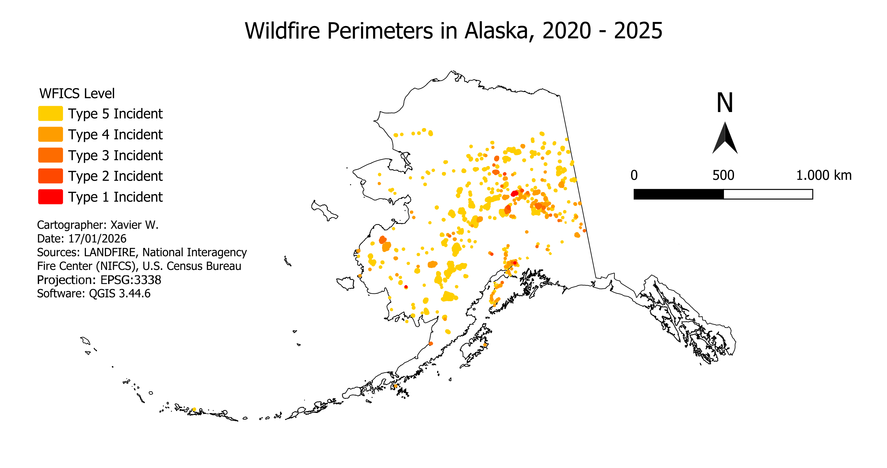
   

    
   

    
   

    
   

    
   

## Continental U.S. Tornadoes

I chose tornadoes as my next primary topic to analyze the spatial distribution of another major natural disaster in the United States, as it highlights the regions that are particularly vulnerable to severe weather. Tornado data were gathered from the National Oceanic and Atmospheric Administration (NOAA), whose records date back to 1950, but the analysis was limited to 2004 - 2024 to reflect improvements in detection technology and reporting accuracy.

 

    
   
    <em>Figure 3.a</em>

Tornado activity follows a distinct spatial pattern shaped by atmospheric circulation and topography. Hotspots develop where warm, moist air from the Gulf of Mexico interacts with cooler, drier air and strong wind shear, while activity declines sharply in the western United States due to mountainous terrain and less favorable atmospheric conditions. Tornado intensity is classified using the Enhanced Fujita (EF) scale, which ranks events from EF0 (weakest) to EF5 (strongest) based on estimated wind speeds and damage.

* Dense clustering in Oklahoma, Kansas, Nebraska, and southeastern states (Mississippi, Alabama)
* Minimal tornado presence in western states
* EF0 - EF1 events are most numerous, while stronger events are more dispersed
* Points cover roughly two-thirds of the continental U.S., primarily east of the Rocky Mountains

 

    
   
    <em>Figure 3.b</em>

This map highlights tornado movement across multiple states, showing both the typical southwest-to-northeast trajectory and variations. It was created by combining the initial and terminal points of each tornado based on their latitude and longitude. Incorporating EF levels along the full tornado tracks provides greater analytical insight than mapping them solely at the initial points, as it allows identification of regions that are more vulnerable to severe tornado impacts.
The tornado tracks show strong, consistent linearity, reflecting the steering influence of mid-latitude westerlies and cold fronts.

* Consistent influence of mid-latitude westerlies and cold fronts
* Southeast territories have higher concentration of long-track events
* Tracks sometimes form clusters, e.g., North Dakota - Minnesota and parts of the East Coast

 

    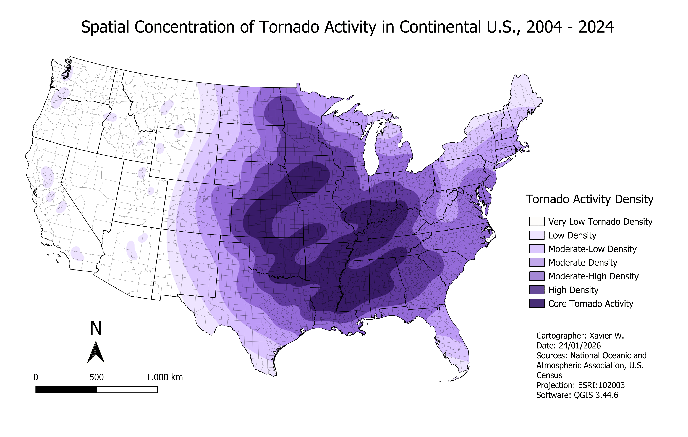
   
    <em>Figure 3.c</em>

I created this kernel density map using kernel density estimation (KDE), incorporating both tornado initial points and their tracks. The estimation was also weighted by each tornado’s EF level. This approach produces gradual transitions in tornado density and reveals a strong east–west contrast, with the highest concentrations across the central interior of the United States and much lower densities in the mountainous and coastal regions in the western states.

* Tornady activity core is centered in the central United States and gradually expands outward into the Southeast
* The Northeast, upper Midwest, and Florida exhibit generally low to moderate densities, with no persistent core activity
* Very low tornado density dominates much of the western United States, particularly across mountainous and coastal regions
* Small, localized clusters of low-level tornado density appear in parts of the western U.S.
 
 

    
      
    <em>Figure 3.d</em>

This diagram ranks the ten U.S. states with the highest tornado activity over the past two decades, highlighting notable geographic patterns in severe weather occurrence. Tornado events were compiled in Microsoft Excel by summing all occurrences for each state and ranking them accordingly. Texas emerges as a clear outlier with 2,334 recorded events, exceeding the second-ranked state, Kansas, with 1,637 occurrences by a substantial margin. Notably, almost all of these states recorded over 1,000 tornadoes during this period, illustrating the widespread distribution of tornado activity across the Central and Southern United States. Key highlights include:

* Texas recorded the highest total number of tornadoes (2,334 events)
* Kansas follows with 1,637 tornadoes
* States like Mississippi (1,367 events) and Alabama (1,360 events) rank in the top four, showing that significant tornado activity also occurs outside the traditional "Tornado Alley"
* Nine of the top ten states exceeded 1,000 tornadoes during this period, demonstrating the broad spatial distribution of severe weather

 

    
     
    <em>Figure 3.e</em>

This diagram interprets the distribution of only high-intensity tornadoes (EF3-EF5) across the United States, highlighting regional differences in severe tornado occurrence. State-level rankings were generated by filtering tornado event data in Microsoft Excel based on intensity and summing total events per state. Key observations include:

* Kansas and Texas recorded the highest number of high-intensity tornadoes, with 60 events each.
* Mississippi followed closely with 58 events.
* Arkansas appears among the top ten with 27 events, despite not ranking among the states with the highest overall tornado counts.
* Several states with high total tornado activity, including Illinois, Louisiana, and Florida, are absent from this high-intensity ranking.
 

    
     
    <em>Figure 3.f</em>

Tornado activity is dominated by low-intensity events, with EF0 and EF1 ratings accounting for the vast majority of occurrences. In contrast, EF2 and higher-intensity tornadoes are rare, highlighting the relative scarcity of the most severe storms in the overall dataset.
     

         

    
   
    <em>Figure 3.g</em>

Within high-intensity tornadoes, EF3 events dominate, while EF4 and EF5 occurrences are comparatively rare. This highlights that even among severe storms, the most extreme tornadoes are uncommon, making them critical points of study for risk assessment and mitigation.
    

 
