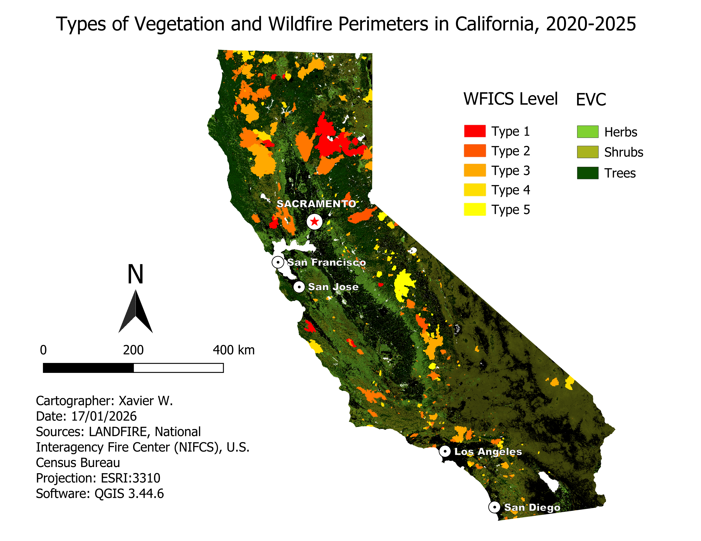

# 👤 Profile

I am an Indonesian undergraduate student at the University of Toulouse – Jean Jaurès, where I study Geography, Spatial Planning, and Environmental Studies. My interests include geomatics, GIS, and spatial data analysis.

## 💻 Specialties 

## 🗣️ Languages

# 🗂️ Portfolio
A collection of my geospatial analyses and mapping projects, focusing on real-world challenges such as natural disasters, socio-demographic inequalities, and other spatial disparities across different regions worldwide, using data from a variety of governmental and organizational sources.
#### Overview
- [North America](#north-america)

## North America
North America, the third-largest continent, spans around 24.7 million square kilometers, encompassing Canada, the United States, and Mexico. It extends from the northern Arctic tundra to the southern tropical regions. This continent experiences prominent natural factors that coincide with its population's distribution. I chose to start with this region because of its environmental and demographic diversity, ranging from remote natural wilderness to densely populated urban metropolises.

### Natural Disasters
#### Wildfires

    
   
  <em>Figure 1.a</em>

    
   
  <em>Figure 1.b</em>

    
   
  <em>Figure 1.c</em>

    
   
  <em>Figure 1.c</em>

#### Tornadoes

    
   
  <em>Figure 2.a</em>

### Demographics
