# 👤 Profile

My name is Xavier William, I am an Indonesian undergraduate student at the University of Toulouse – Jean Jaurès, where I study Geography, Spatial Planning, and Environmental Studies. My interests include geomatics, GIS, and geospatial data analysis.

## 💻 Specialties 

## 🗣️ Languages

# 🗂️ Portfolio
A collection of geospatial projects focused on identifying environmental and socio-economic disparities across different territories, in order to visualize how they reflect pertinent global issues. This portfolio includes maps and analytical diagrams created to document my GIS skills, experiment a variety of methods, and build a personal reference for future projects.
#### Overview
- [Wildfires](#wildfires)
- [Tornadoes](#tornadoes)

## United States

### Biomes of North America

    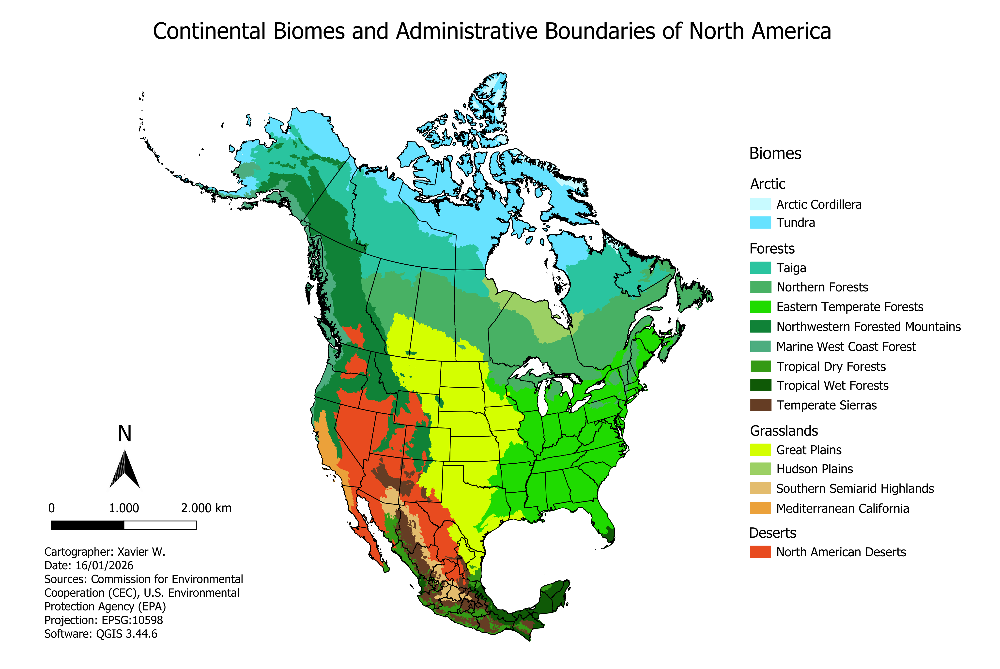
   

I developed this map first to illustrate North America’s principal biomes using Level I Ecoregion data, providing environmental context for the continent’s natural phenomena and demographic patterns. Biome boundaries are displayed alongside national administrative divisions, including Canadian provinces, U.S. states, and Mexican *estados*. The continent encompasses a wide range of biomes. Firstly, the Arctic Cordillera and tundra dominate the far north, with cold, arid polar conditions, while Canada’s expansive boreal forests exist under subarctic climates. Secondly, the northeastern United States is characterized by eastern temperate forests, and the central Great Plains feature grasslands across semi-arid to temperate climatic zones. Thirdly, western regions include Pacific coastal forests with marine climates, mountainous northwestern forests spanning multiple elevations, and California’s Mediterranean zone. Lastly, the Southwest features hot, dry deserts, while southern Mexico hosts tropical wet-dry forests, temperate mountain ranges, and semi-arid plateau regions.

### Wildfires

    
   

In this map, I visualized vegetation cover across the United States, highlighting the transition from dense eastern forests to herbaceous landscapes extending from North Dakota to eastern Texas. The Midwest exhibits comparatively lower vegetation density, while shrublands dominate much of the West and Alaska. By overlaying wildfire perimeter polygons, the map shows that forests in the eastern U.S. remain largely undisturbed, whereas the West Coast emerges as the primary area of concern, with numerous high-complexity (Type 1) fires. This pattern unexpectedly extends into Alaska, despite its much colder climate. Secondary areas of concern include the interior western states, particularly New Mexico, Arizona, Colorado, and Idaho, where moderate to high wildfire activity is also evident. Texas displays a distinct spatial pattern, as wildfire activity in the eastern part of the state is dominated by smaller low-complexity (Type 5) fires, while northern Texas contains a prominent Type 1 fire polygon.

    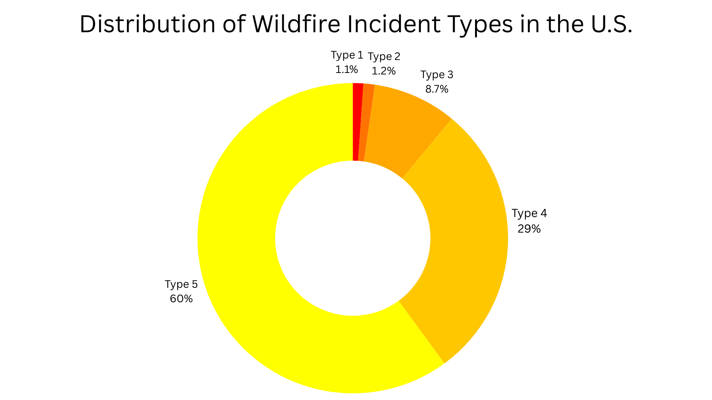
   

    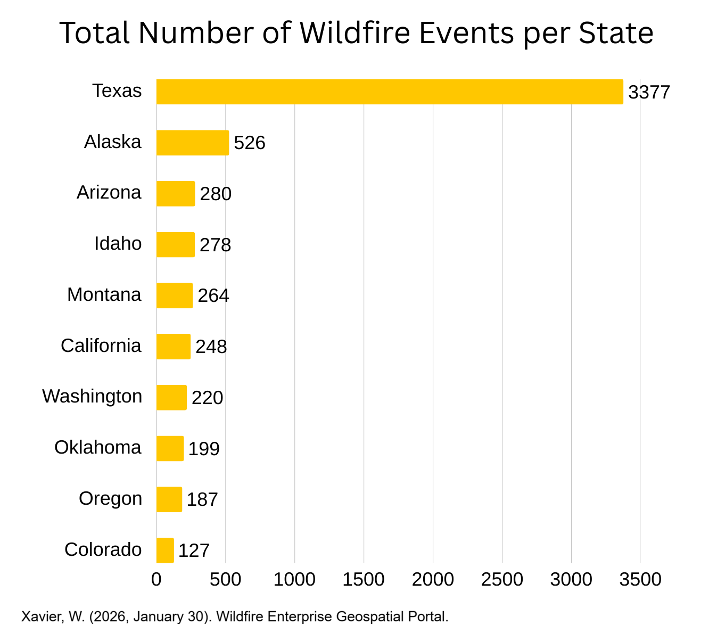
   

    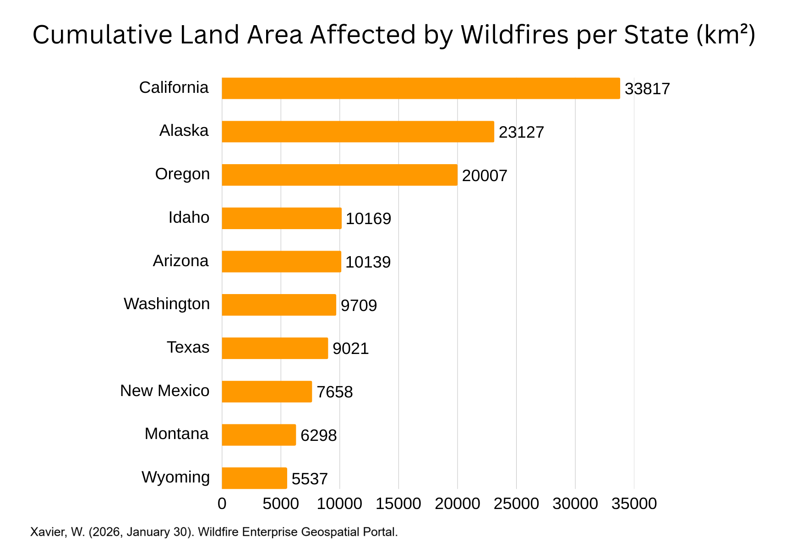
   

    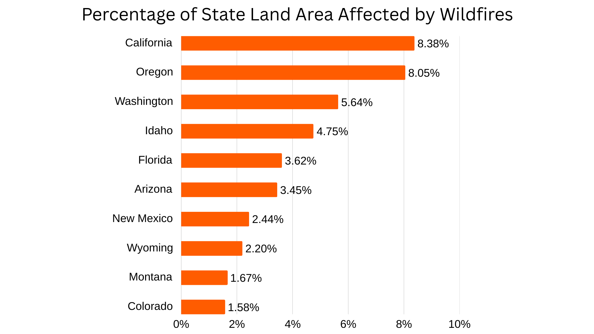
   

### Tornadoes

    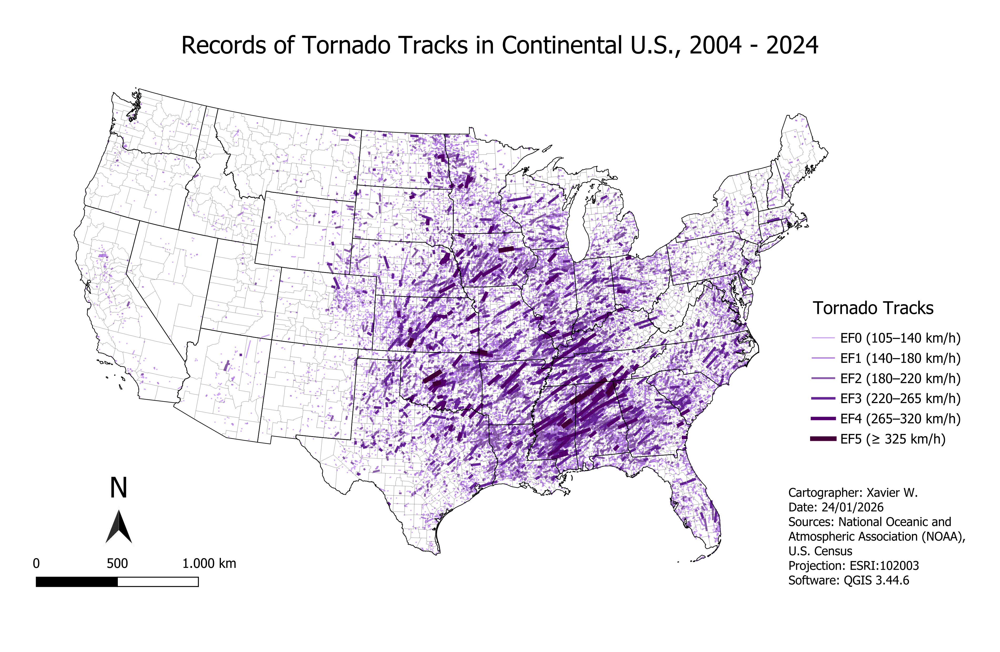
   

    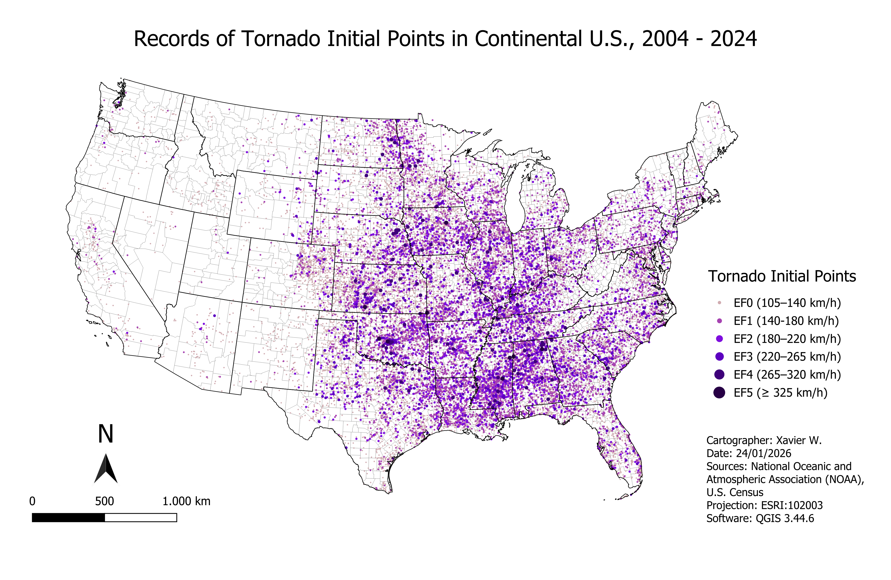
   

 

    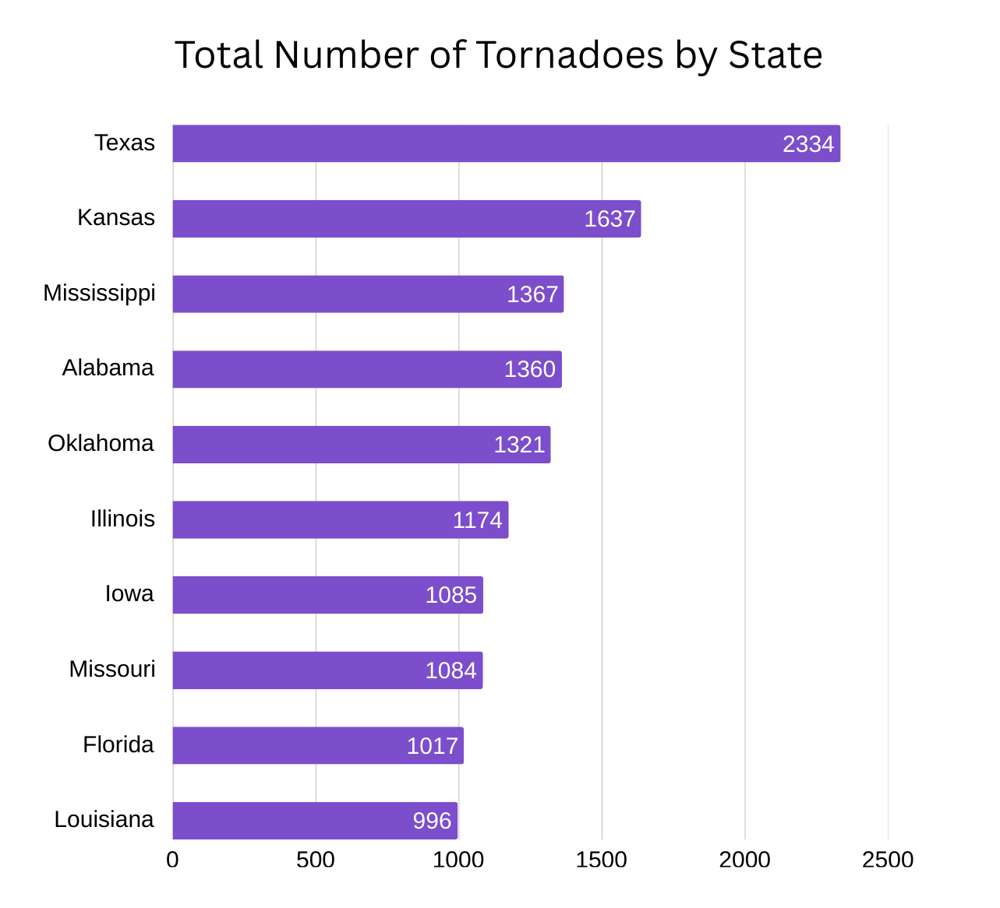
      
    <em>Figure 3.c</em>

This diagram ranks the ten U.S. states with the highest tornado activity over the past two decades, highlighting notable geographic patterns in severe weather occurrence. Tornado events were compiled in Microsoft Excel by summing all occurrences for each state and ranking them accordingly. Texas emerges as a clear outlier with 2,334 recorded events, exceeding the second-ranked state, Kansas, with 1,637 occurrences by a substantial margin. Notably, almost all of these states recorded over 1,000 tornadoes during this period, illustrating the widespread distribution of tornado activity across the Central and Southern United States. Key highlights include:

* Texas recorded the highest total number of tornadoes (2,334 events)
* Kansas follows with 1,637 tornadoes
* States like Mississippi (1,367 events) and Alabama (1,360 events) rank in the top four, showing that significant tornado activity also occurs outside the traditional "Tornado Alley"
* Nine of the top ten states exceeded 1,000 tornadoes during this period, demonstrating the broad spatial distribution of severe weather
 

    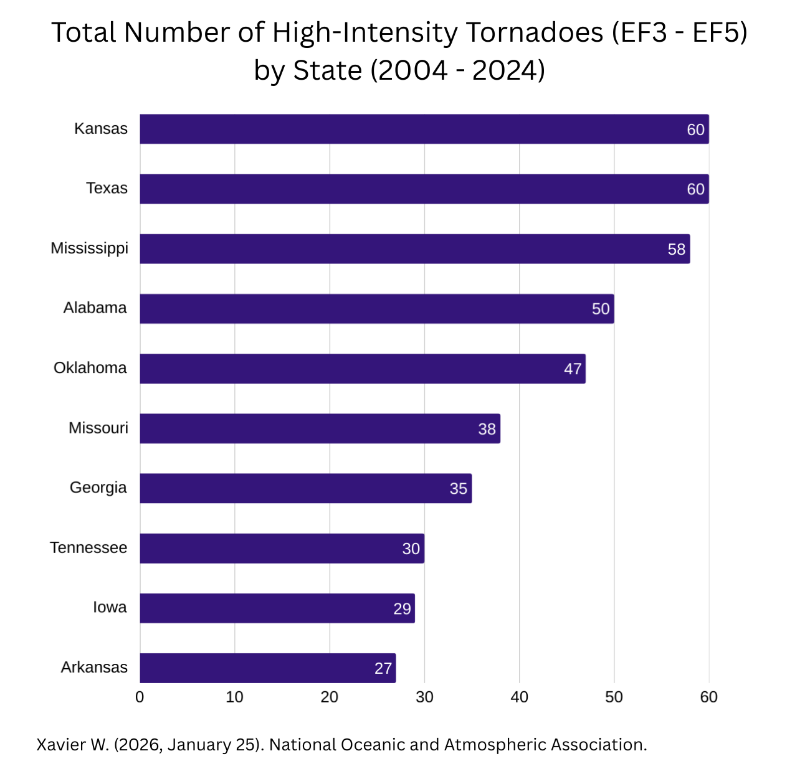
     
    <em>Figure 3.d</em>

This diagram interprets the distribution of only high-intensity tornadoes (EF3–EF5) across the United States, highlighting regional differences in severe tornado occurrence. State-level rankings were generated by filtering tornado event data in Microsoft Excel based on intensity and summing total events per state. Key observations include:

* Kansas and Texas recorded the highest number of high-intensity tornadoes, with 60 events each.
* Mississippi followed closely with 58 events.
* Arkansas appears among the top ten with 27 events, despite not ranking among the states with the highest overall tornado counts.
* Several states with high total tornado activity, including Illinois, Louisiana, and Florida, are absent from this high-intensity ranking.
 

    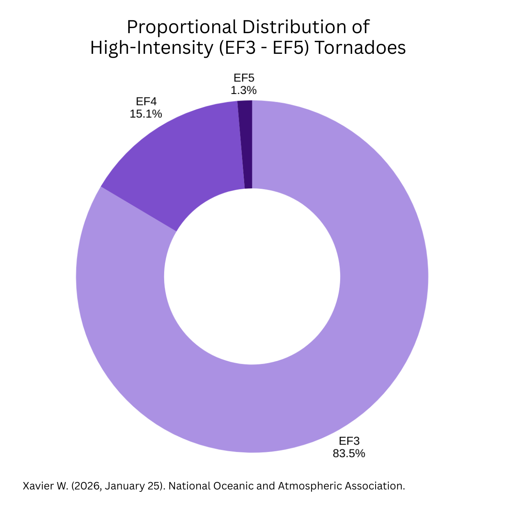
     
    <em>Figure 3.e</em>

Tornado activity is dominated by low-intensity events, with EF0 and EF1 ratings accounting for the vast majority of occurrences. In contrast, EF2 and higher-intensity tornadoes are rare, highlighting the relative scarcity of the most severe storms in the overall dataset.
     

         

    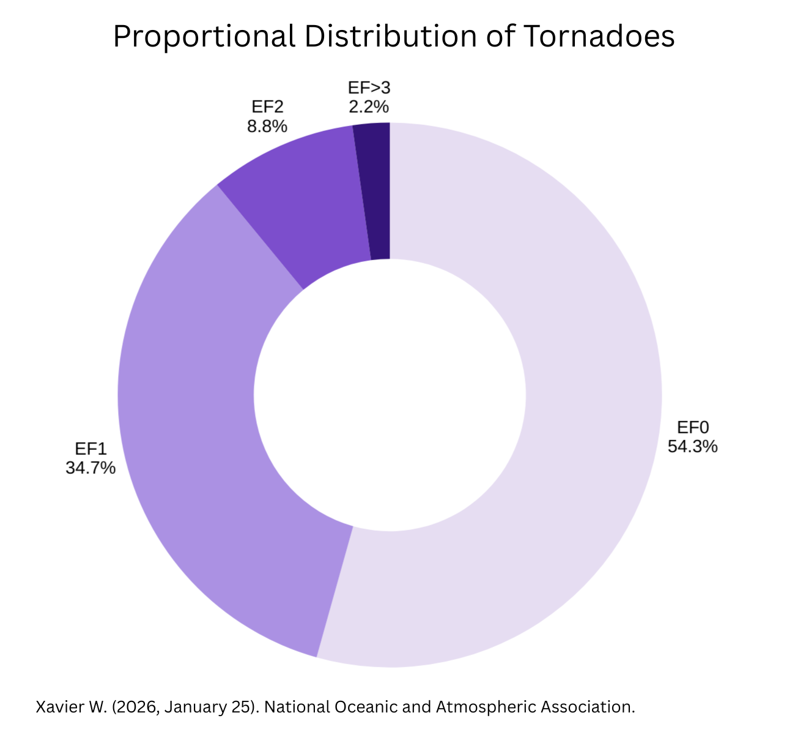
   
    <em>Figure 3.f</em>

Within high-intensity tornadoes, EF3 events dominate, while EF4 and EF5 occurrences are comparatively rare. This highlights that even among severe storms, the most extreme tornadoes are uncommon, making them critical points of study for risk assessment and mitigation.
    

### Demographics
